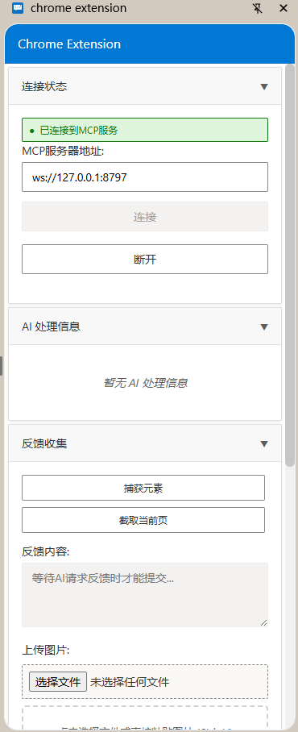
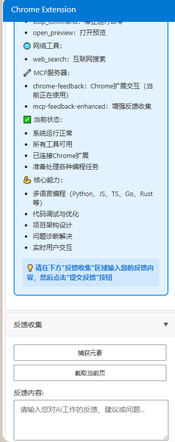

# 🚀 MCP Chrome Feedback - 让AI和用户无缝交互的神器！

> **一个让 Cursor/Claude 能够通过 Chrome 扩展与用户实时交互的开源项目**

## 🎯 这是什么？

你有没有遇到过这种情况：
- AI 生成的代码不符合预期，但不知道怎么给它反馈
- 想让 AI 帮你分析网页内容，但它看不到你的屏幕
- 希望能够直接在浏览器中给 AI 发送截图和文字说明

**MCP Chrome Feedback** 就是为了解决这些痛点而生的！它让 Cursor 中的 AI 能够：
- 📸 **直接获取你的屏幕截图**
- 💬 **实时收集你的文字反馈**
- 🎯 **捕获网页元素信息**
- 🔄 **建立双向交互通道**



## ✨ 核心特性

### 🤖 智能交互
- **实时反馈收集**: AI 可以主动向你询问意见
- **多媒体支持**: 文字 + 图片 + 网页元素，想怎么交流就怎么交流
- **元素捕获**: 点击网页任意元素，AI 立即获得详细信息

### 🔧 技术亮点
- **零配置启动**: 一条命令即可开始使用
- **多实例支持**: 支持同时运行多个服务实例
- **自动端口管理**: 端口冲突？不存在的！
- **跨平台兼容**: Windows/Mac/Linux 全支持

### 🎨 用户友好
- **Chrome 扩展界面**: 熟悉的浏览器环境
- **拖拽上传**: 图片直接拖进来就行
- **实时状态**: 连接状态一目了然

## 🚀 快速开始

### 1️⃣ 一键安装 MCP 服务

在 Cursor 的 MCP 配置中添加：

```json
{
  "mcpServers": {
    "chrome-feedback": {
      "command": "npx",
      "args": ["--yes", "mcp-chrome-feedback@latest"]
    }
  }
}
```

### 2️⃣ 安装 Chrome 扩展

1. 下载项目源码
2. 打开 Chrome 扩展管理页面 (`chrome://extensions/`)
3. 开启开发者模式
4. 加载 `chrome-extension` 文件夹

### 3️⃣ 开始使用

在 Cursor 中直接对 AI 说：
```
请使用 interactive_feedback 工具收集我的反馈
```

AI 会自动弹出反馈界面，你就可以开始交互了！



## 🎬 使用场景

### 🖥️ Web 开发调试
"AI，这个页面的布局有问题，我截个图给你看看"

### 📊 数据分析
"帮我分析这个表格，我把截图发给你"

### 🎨 UI/UX 设计
"这个界面我觉得不够美观，你看看怎么改进"

### 📝 文档协作
"这段代码的逻辑不太清楚，我标注一下发给你"

## 🔧 高级配置

### 自定义端口
```json
{
  "mcpServers": {
    "chrome-feedback": {
      "command": "npx",
      "args": ["--yes", "mcp-chrome-feedback@latest"],
      "env": {
        "MCP_CHROME_PORT": "8900"
      }
    }
  }
}
```

### 开发者模式
```bash
git clone https://github.com/2019-02-18/MCX.git
cd MCX/mcp-chrome-feedback
npm install && npm run build
```


## 🛠️ 技术栈

- **后端**: Node.js + TypeScript + WebSocket
- **前端**: Chrome Extension + HTML5 + CSS3
- **协议**: Model Context Protocol (MCP)
- **构建**: npm + TypeScript Compiler

## 🤝 贡献指南

这是一个开源项目，欢迎大家贡献代码和想法！

### 如何贡献
1. Fork 项目
2. 创建特性分支
3. 提交更改
4. 发起 Pull Request

### 需要帮助的地方
- [ ] 更多 Chrome API 集成
- [ ] 界面美化和用户体验优化
- [ ] 多语言支持
- [ ] 性能优化

## 📸 更多截图

如果你想看更多界面截图或功能演示，我可以提供更多图片！

## 🔗 项目链接

- **GitHub**: https://github.com/2019-02-18/MCX
- **NPM**: https://www.npmjs.com/package/mcp-chrome-feedback
## 💡 结语

AI 的未来在于更好的人机交互，而不是单方面的输出。**MCP Chrome Feedback** 就是朝着这个方向迈出的一小步。

如果你也在使用 Cursor 或者对 AI 交互有兴趣，不妨试试这个项目。有任何问题或建议，欢迎在评论区留言！

---

**⭐ 觉得不错的话，给个 Star 支持一下吧！⭐**

## 🏷️ 标签

`#AI` `#Cursor` `#Chrome扩展` `#MCP` `#开源项目` `#人机交互` `#WebDev` `#TypeScript` 